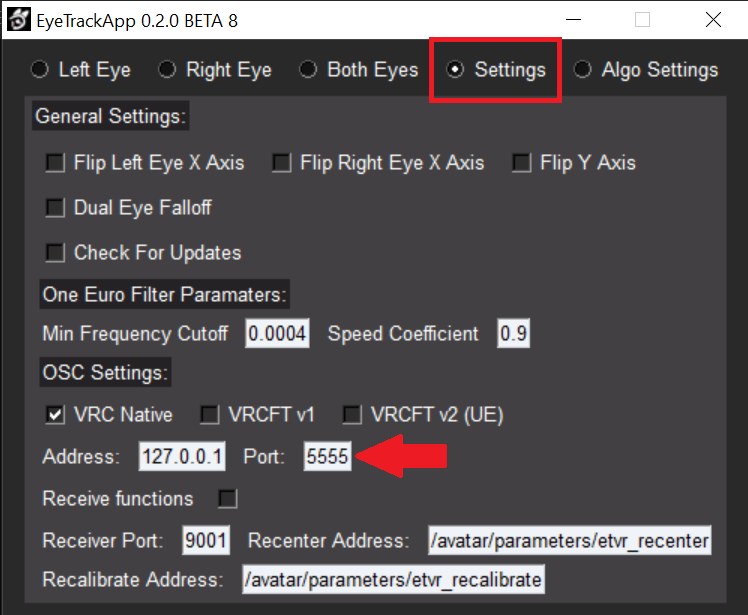
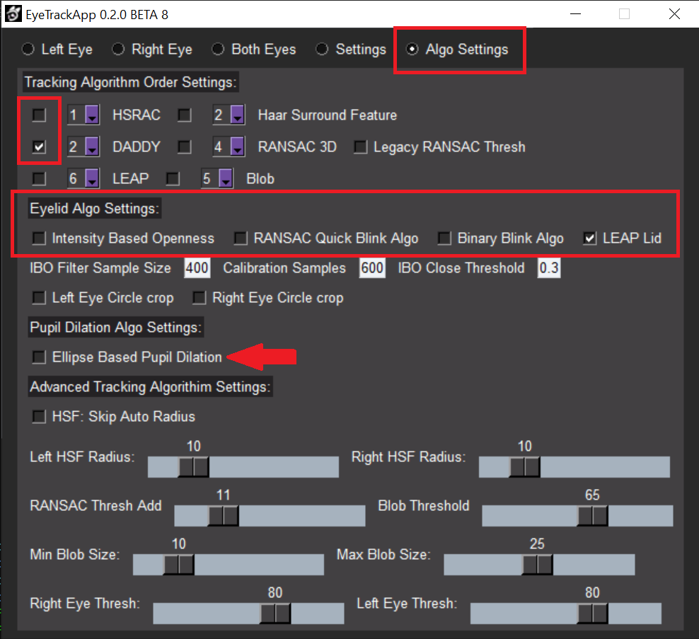
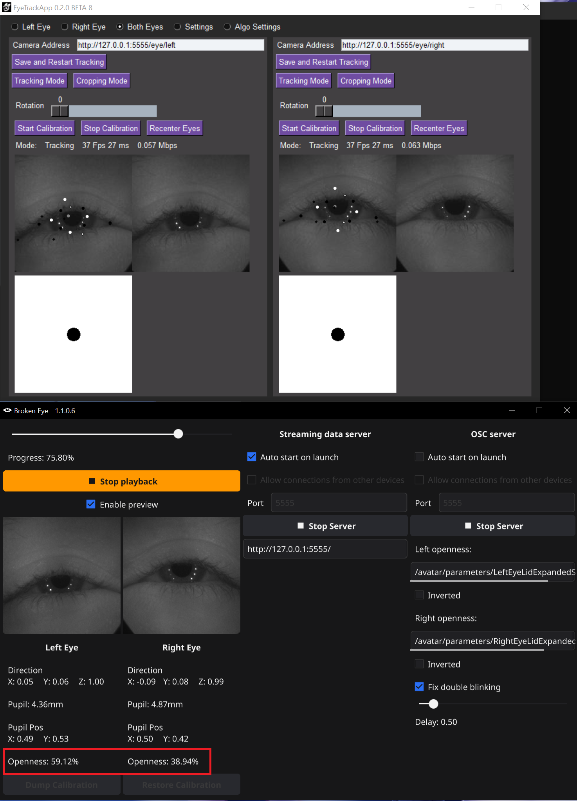

# Configuring EyeTrackVR

Download and install the pre-release version of [EyeTrackVR](https://github.com/EyeTrackVR/EyeTrackVR/releases),
  recommended version [branch.8](https://github.com/EyeTrackVR/EyeTrackVR/releases/tag/v1.0.0-HSF-and-new-algos-feature-branch.8)

> [!IMPORTANT]
> Before setting up, make sure you have launched BrokenEye and connected to the device (or loaded a recording).

## Download configuration file

You can download my configuration file here 
[eyetrack_settings.json](https://raw.githubusercontent.com/ghostiam/BrokenEye/main/_assets/eyetrack_settings.json) (put it in the same folder as the EyeTrackVR executable file) \
or configure it yourself:

## Configuring EyeTrackVR yourself

### After launching EyeTrackVR, you need to configure OSC:

- Go to EyeTrackVR `Settings` tab.
- Change OSC port to `5555`.
- Restart EyeTrackVR.

### Setting up EyeTrackVR algorithms:

- Go to the `Algo Settigs` tab.
- Select **ONLY** `DADDY` tracking algorithm.
- Set `Eyelid algo` **ONLY** `LEAP Lid`.
- **Be sure** to disable `Pupil Dilation Algo`, otherwise EyeTrackVR will not work.

### Now we need to transfer the image from the cameras to EyeTrackVR:

- Go to the `Both Eyes` tab
- In the `Camera Address` fields enter:
-
    - For the left eye: `http://127.0.0.1:5555/eye/left`
-
    - For the right eye: `http://127.0.0.1:5555/eye/right`
- Click `Save and Restart Tracking` in both panels.
- Ready! (yes, no calibration needed since we don't use camera data for eye tracking)

After this, you will receive eye openness data in BrokenEye (turn on preview and make sure that the `Openness` values
change depending on how open your eyes, and not just 0% and 100%).

