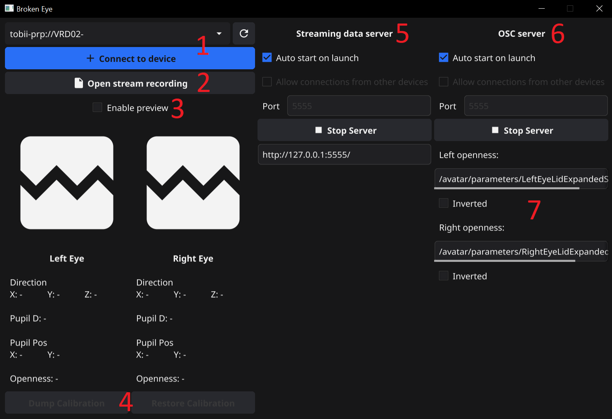

# BrokenEye

BrokenEye is an application that will allow you to obtain more detailed data from the Pimax Crystal Eye Tracker, namely:

- Gaze direction (normalized)
- Pupil diameter
- Blink / Eye openness ([more details below](#using-an-external-application-to-obtain-eye-openness-data))
- Streaming images from cameras!

## How to install

1. Download the latest version of the application
   from [releases](https://github.com/ghostiam/BrokenEye/releases/latest).
2. Just launch the application.

## How to use

After launching the application you can choose:



1) Which device will it connect to?
2) Open data you have already recorded (or record if you are already connected to the device)
3) Do not forget to enable or disable preview of data and images from cameras,
   whenever you need it, since previewing will create unnecessary load on your computer.
4) Save or load Eye Tracker calibration data (be sure to calibrate the device before saving!).
5) Server settings for streaming data and images from the camera.
6) OSC server settings to receive eye openness
   data [from another application](#using-an-external-application-to-obtain-eye-openness-data).
7) OSC server parameters.

All settings are saved automatically.

> [!NOTE]
> You don't need to enable recording to use the application! \
> Recording is only necessary if you want to play back the data you received from the device in the future,
> for example, to configure an external application so as not to wear a headset.

## Use in VRChat

In order to use in VRChat, you should
install [VRCFaceTracking](https://docs.vrcft.io/docs/vrcft-software/vrcft#install-vrcfacetracking)
and a plugin for it [PimaxCrystalAdvanced](https://github.com/ghostiam/PimaxCrystalAdvanced)

First run BrokenEye and then VRCFaceTracking.

## Using an external application to obtain eye openness data

Since we can only receive data on blinking from the tracker, to obtain data on eye openness, it is necessary
use another application that will send data to BrokenEye via the OSC protocol,
for example [EyeTrackVR](https://github.com/EyeTrackVR/EyeTrackVR)

To do this you need:

- Download and install the pre-release version of [EyeTrackVR](https://github.com/EyeTrackVR/EyeTrackVR/releases),
  recommended version [branch.11](https://github.com/EyeTrackVR/EyeTrackVR/releases/tag/v1.0.0-HSF-and-new-algos-feature-branch.11) or [branch.8](https://github.com/EyeTrackVR/EyeTrackVR/releases/tag/v1.0.0-HSF-and-new-algos-feature-branch.8)

> [!IMPORTANT]
> Before setting up, make sure you have launched BrokenEye and connected to the device (or loaded a recording).

After launching EyeTrackVR, you need to configure OSC:

- Go to EyeTrackVR settings
- Change OSC port to `5555`
- Restart EyeTrackVR.

Now we need to transfer the image from the cameras to EyeTrackVR:

- Go to the `Both Eyes` tab
- In the `Camera Address` fields enter:
-
    - For the left eye: `http://127.0.0.1:5555/eye/left`
-
    - For the right eye: `http://127.0.0.1:5555/eye/right`
- Click `Save and Restart Tracking` in both panels.
- Click `Cropping Mode` in both panels.
- Select the entire image in both panels.
- Click `Tracking Mode` in both panels.
- Ready! (yes, no calibration needed since we don't use camera data for eye tracking)

After this, you will receive eye openness data in BrokenEye (turn on preview and make sure that the `Openness` values
change depending on how open your eyes, and not just 0% and 100%).

## How to get data

There are 2 APIs for receiving data:

- [HTTP](#http-api) (only for camera images)
- [RAW](#raw-api) - data is transmitted over a TCP connection, in JSON format for processed data, and images in raw
  format.

### HTTP API

Images from cameras are transmitted as [MJPEG](https://en.wikipedia.org/wiki/Motion_JPEG) stream, which are available
via
address:

For the left eye:

```
http://127.0.0.1:5555/eye/left
```

For the right eye:

```
http://127.0.0.1:5555/eye/right
```

You can also preview images in your browser by going to:

```
http://127.0.0.1:5555/
```

The default port is `5555`, but it can be changed in the application.

### RAW API

To receive data in RAW format, you need to connect via TCP to the application on port `5555`.

The request for data looks like this:

|   ID   | description                                  |
|:------:|:---------------------------------------------|
| `0x00` | Request for eye tracking data in JSON format |
| `0x01` | Request for raw image of left eye            |
| `0x02` | Request for raw image of right eye           |

we send:

|  ID  |
|:----:|
| byte |

we get in the loop:

|  ID  |          Size           |      Data      |
|:----:|:-----------------------:|:--------------:|
| byte | 4 bytes (little endian) | Array of bytes |

An example in C# for obtaining eye tracking data can be viewed
in [this](https://github.com/ghostiam/PimaxCrystalAdvanced/blob/main/BrokenEye/Client.cs) file.

#### Eye tracking data format:

<details>
<summary>JSON example</summary>

```json5
{
  "left": {
    "gaze_direction_is_valid": false,
    "gaze_direction": [
      // X
      0,
      // Y
      0,
      // Z
      0
    ],
    "pupil_diameter_is_valid": false,
    "pupil_diameter_mm": -1,
    "pupil_position_on_image_is_valid": false,
    "pupil_position_on_image": [
      // X
      -1,
      // Y
      -1
    ],
    "openness_is_valid": true,
    "openness": 1
  },
  "right": {
    "gaze_direction_is_valid": false,
    "gaze_direction": [
      // X
      0,
      // Y
      0,
      // Z
      0
    ],
    "pupil_diameter_is_valid": false,
    "pupil_diameter_mm": -1,
    "pupil_position_on_image_is_valid": false,
    "pupil_position_on_image": [
      // X
      -1,
      // Y
      -1
    ],
    "openness_is_valid": true,
    "openness": 1
  }
}
```

</details>

#### Raw image format:

|  Width  | Height  | Bit per pixel | Raw data |
|:-------:|:-------:|:-------------:|:--------:|
| 4 bytes | 4 bytes |    4 bytes    | N bytes  |

Where N is the size of the image in bytes:
```
N = Width * Height * (Bit per pixel / 8)
```
